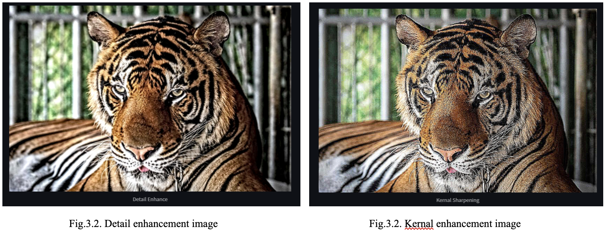
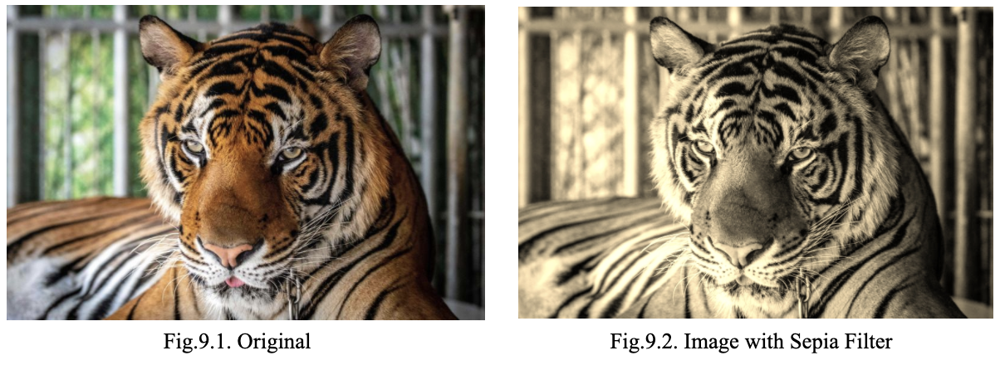
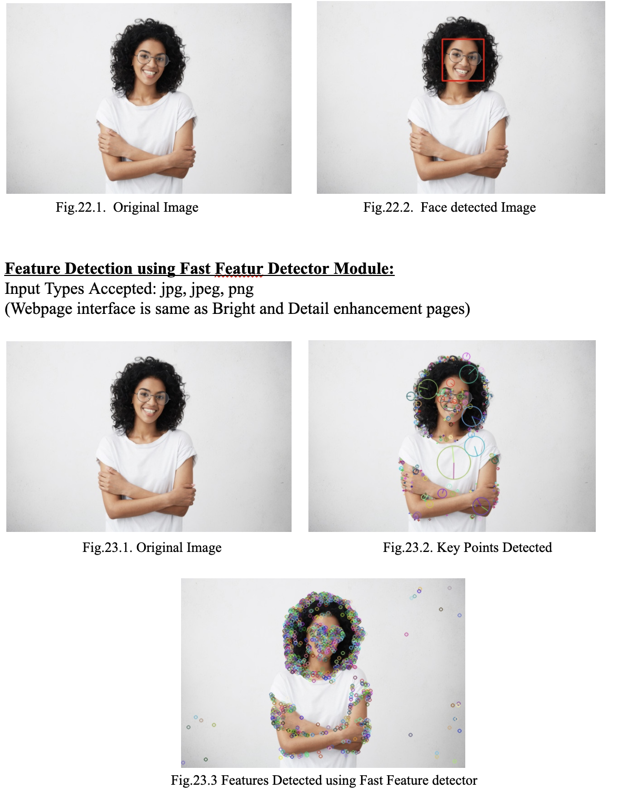

# Photoshop Tool using Python and OpenCV

A photoshop web app deployed in streamlit having various filters and image processing capabilities built using Python and OpenCV modules.


[](https://www.python.org/)


## Author

- [Adarsh Sankar R S](https://github.com/adarshsankarrs)

## Table of contents
- [Features](#Features)
- [Installation](#Installation-steps)
- [Screenshots](#Screenshots)
- [Examples](#examples)
<!-- - [Demo](#demo) -->


## Features

- Filter Modules
  - Bright
  - Detail Enhance
  - Invert
  - Summer
  - Winter
  - Daylight
  - High Contrast
  - Sepia
  - Splash
  - Emboss
  - 60s TV
  - Dual tone
  - Cartoon
  - Pencil Drawing
  - Comic

- Converting Image to Sketch
- Image Inpainting
- Document Scanner
- Adding Titles to Images
- Crop Images
- Edge and contour detection
- Face detection
- Feature Detection

## Installation steps

#### Install Anaconda

```
  https://www.anaconda.com/products/individual
```


#### Create a conda environment and activate it

```
  $ conda create streamlitapp
  $ conda activate streamlitapp
```

#### Install required packages from requirements.txt

```
  # Clone this repository and cd into it
  $ cd 
  $ pip install -r requirements.txt
```

#### Run the streamlit app

```
  $ streamlit run app.py  
```


## Screenshots

### Filter Modules:

#### High Contrast:
	Input Types Accepted: jpg, jpeg, png
	(Webpage interface is same as Bright and Detail enhancement pages)

<p align="center">

</p>


#### Bright:
	Input Types Accepted: jpg, jpeg, png

<p align="center">

</p>


#### Detail Enhancement:
	Input Types Accepted: jpg, jpeg, png


<p align="center">

</p>
 
<p align="center">

</p>
 


#### Invert:
	Input Types Accepted: jpg, jpeg, png
	(Webpage interface is same as Bright and Detail enhancement pages)

<p align="center">

</p>
 
   

#### Summer:
	Input Types Accepted: jpg, jpeg, png
	(Webpage interface is same as Bright and Detail enhancement pages)

	 
<p align="center">

</p>
 

#### Winter:
	Input Types Accepted: jpg, jpeg, png
	(Webpage interface is same as Bright and Detail enhancement pages)

<p align="center">

</p>
 
	
#### Daylight:
	Input Types Accepted: jpg, jpeg, png
	(Webpage interface is same as Bright and Detail enhancement pages)
	


<p align="center">

</p>
 


#### Sepia:
	Input Types Accepted: jpg, jpeg, png
	(Webpage interface is same as Bright and Detail enhancement pages)


<p align="center">

</p>

	   
#### Splash:
	Input Types Accepted: jpg, jpeg, png
	(Webpage interface is same as Bright and Detail enhancement pages)
Note: The splash filter only works successfully for images with objects having high contrast colors (Eg: Yellow and Blue). The image given below is a good example over which the splash filter works successfully.


 
<p align="center">

</p>


 

#### Emboss:
	Input Types Accepted: jpg, jpeg, png
	(Webpage interface is same as Bright and Detail enhancement pages)
<p align="center">

</p>
	   

#### 60s TV:
	Input Types Accepted: jpg, jpeg, png
	(Webpage interface is same as Bright and Detail enhancement pages)
Note: This filter also consists of 2 other input parameters the noise and threshold values. Our Webpage provides a slider widget to set these parameter values seamlessly. The image example given below shows the interface and outputs.

<p align="center">

</p>

        

#### Dual Tone:
	Input Types Accepted: jpg, jpeg, png
	(Webpage interface is same as Bright and Detail enhancement pages)

	  
   
<p align="center">

</p>


	   

#### Pencil Drawing:
	Input Types Accepted: jpg, jpeg, png
	(Webpage interface is same as Bright and Detail enhancement pages)
<p align="center">

</p>
	  

#### Comic (Using K-Means):
	Input Types Accepted: jpg, jpeg, png
	(Webpage interface is same as Bright and Detail enhancement pages)

<p align="center">

</p>


	 

#### Image to Sketch Module:
	Input Types Accepted: jpg, jpeg, png
	(Webpage interface is same as Bright and Detail enhancement pages)

<p align="center">

</p>


       

#### Image inpainting Module:
	Input Types Accepted: jpg, jpeg, png
	(Webpage interface is same as Bright and Detail enhancement pages)


<p align="center">

</p>


Note: This module takes 2 images as its inputs: the first benign our original image and the second is the mask image of the section to be removed or inpainted over. The images given below shows the type of input images and the output generated.

   <p align="center">

</p>
      


#### Doc Scanner Module:
	Input Types Accepted: jpg, jpeg, png
	(Webpage interface is same as Bright and Detail enhancement pages)


<p align="center">

</p>

               

#### Add Title to Image Module:
	Input Types Accepted: jpg, jpeg, png
	(Webpage interface is same as Bright and Detail enhancement pages)
<p align="center">

</p>

#### Edge and contour module
<p align="center">           

</p>

#### Crop Image Module:
	Input Types Accepted: jpg, jpeg, png
<p align="center">           

</p>


#### Face and Feature Detection Module:
	Input Types Accepted: jpg, jpeg, png
<p align="center">           

</p>
